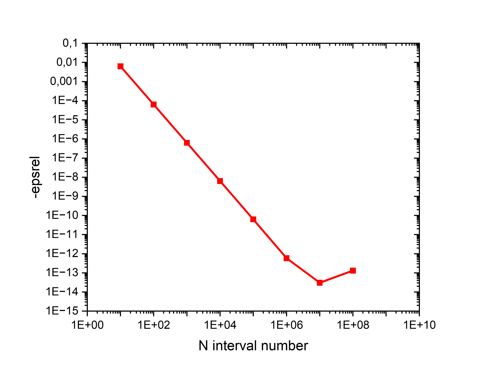

# Task_04 answers

## How far are you from the real solution? How can you reduce the relative error? Which is the minimum error you can find?
The algorithm used in the C script is based on the trapezoidal rule. In the following graph the opposite of ther relative error ***epsrel*** is plotted
against the number of dx intervals ***N***. 

It can be seen that the relative error decreases until $N=10^7$ reaching $epsrel=-3.03×10^-14$ with $I_C= 1.9052386904826180$. This is due to the higher precision gained by dividing integration domain x into a higher number of intervals. However, because doubles are an inexact representation of real numbers, an error is introduced that accumulates for each cycle. For dx sufficiently small this error becomes proportionally higher and leads to a degraded overall precision.

## Using the output file you produce, use an interpreted language to calculate the same integral: is this output similar to the one in point 1? And how close it is?
The result using the python script is $I_py=1.9052386904826628$, that yields an $absrel=4.48×10^-14$
